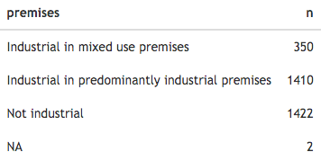
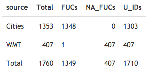

Hi Jane,

I remade the analysis. Here is a brief summary.

From the spreadsheet records with 'premises' value Industrial. 1760 observations

There are some duplicated FUCs

After joining, discarding corrupted geometries and geometries with duplicated FUC (I kept the largest area)

We have 1352 polygons and 346 points. 1698 observations. Thus, there are a few lost in translation (62 observations) - Most 'Cities' records have a corresponding polygon. Missing geometries are from the WMT data set

Possible reasons:

-   Some points coordinates are wrong

-   Something happened with the U_ID I created in our spreadsheet to match with the points and I had to adapt another variable as unique identifier, this match was not perfect.

That's it. I did some visual inspections to verify that the matching is as correct as it can be.

You can check more details of the process here:

[https://npalomin.github.io/sind/Data_report_5.html](https://npalomin.github.io/sind/Data_report_3.html)

Best,

Nicolas
