Original Publish Date: 05 January, 2021 <br> Updated on: `r format(Sys.time(), '%d %B, %Y')`

```{r setup, include=FALSE}
knitr::opts_chunk$set(echo = TRUE)
```

```{=html}
<style>
* {font-family: "Trebuchet MS"}h1{font-size: 190%}h2{font-size: 160%}h3{font-size: 150%}h4{font-size: 130%}h5{font-size: 110%}h6{font-size: 90%}
.r code {
    white-space: pre;
}
</style>
```
## Introduction

This report summarises the outputs of data reviews and analysis for the Southwark Industrial Audit.

## Summary table

The table shows an hyper-linked name of the output, a general comment and a snapshot of research outputs including tools and data diagnosis reports (draft and final version analysis). TThe table is organised according to estimated chronological order from newest to oldest.

+----+------------------------------------------------------------------------------------------------------------------------------------------------+------------------------------------------------------------------------------------------------------------------------------------------------------------------------------------------------------------------------------------------------------------------------------------+----------------------------------------------------------------------------------------------------------------------------------------------------------------------------------------------------------------+
|    | Output                                                                                                                                         | Comment                                                                                                                                                                                                                                                                            | Snapshot[.](https://Lorem/ipsum/dolor/sit/amet,/consectetur/adipiscing/elit,/sed/do/eiusmod/tempor/incididunt/ut/labore/et/dolore/magna/aliqua./Ut/enim/ad/minim/veniam,/quis/nostrud/exercitation/velit.html) |
+====+================================================================================================================================================+====================================================================================================================================================================================================================================================================================+================================================================================================================================================================================================================+
| 14 | [Interactive map update](https://npalomin.github.io/sind/result_feb2021.html)                                                                  | Tool for data categorisation                                                                                                                                                                                                                                                       | 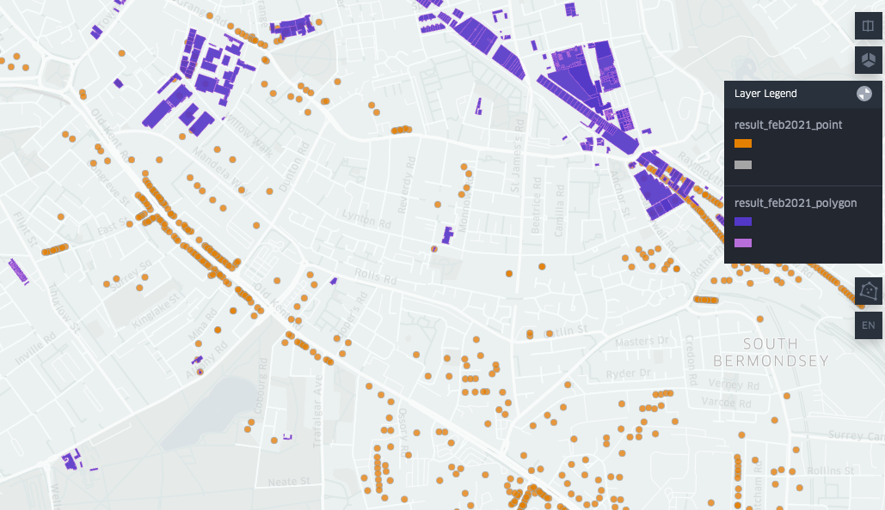                                                                                                                                                                                 |
+----+------------------------------------------------------------------------------------------------------------------------------------------------+------------------------------------------------------------------------------------------------------------------------------------------------------------------------------------------------------------------------------------------------------------------------------------+----------------------------------------------------------------------------------------------------------------------------------------------------------------------------------------------------------------+
| 13 | [Update join survey results](https://npalomin.github.io/sind/Data_report_3.html)                                                               | Merge of survey results with comments table and OKR survey industrial categories.\                                                                                                                                                                                                 | 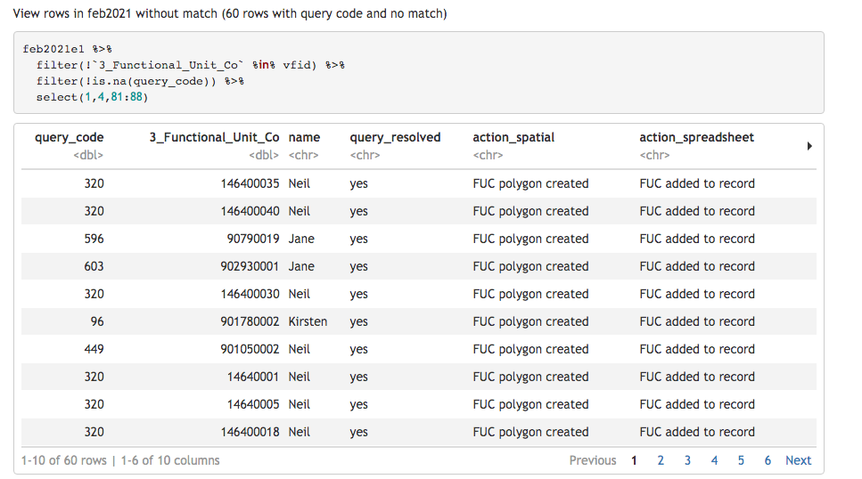                                                                                                                                                                                 |
|    |                                                                                                                                                | folder Feb2021                                                                                                                                                                                                                                                                     |                                                                                                                                                                                                                |
+----+------------------------------------------------------------------------------------------------------------------------------------------------+------------------------------------------------------------------------------------------------------------------------------------------------------------------------------------------------------------------------------------------------------------------------------------+----------------------------------------------------------------------------------------------------------------------------------------------------------------------------------------------------------------+
| 12 | [Data processing to join query table and survey results](https://npalomin.github.io/sind/Data_report_2.html)                                   | Merge of survey results with comments table and OKR survey industrial categories.                                                                                                                                                                                                  | 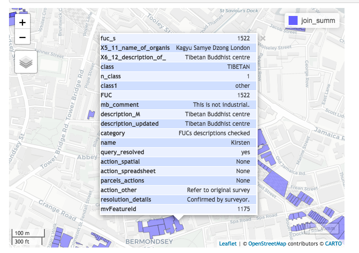                                                                                                                                                                                 |
|    |                                                                                                                                                |                                                                                                                                                                                                                                                                                    |                                                                                                                                                                                                                |
|    |                                                                                                                                                | Tool for data categorisation                                                                                                                                                                                                                                                       |                                                                                                                                                                                                                |
+----+------------------------------------------------------------------------------------------------------------------------------------------------+------------------------------------------------------------------------------------------------------------------------------------------------------------------------------------------------------------------------------------------------------------------------------------+----------------------------------------------------------------------------------------------------------------------------------------------------------------------------------------------------------------+
| 11 | [Interactive map with OKR data and survey results](https://npalomin.github.io/sind/bind.html)                                                  | Tool for data categorisation                                                                                                                                                                                                                                                       | 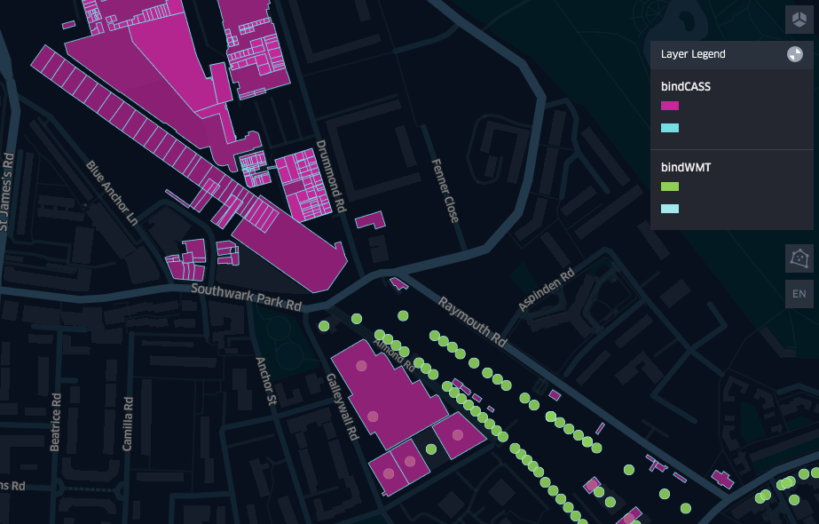                                                                                                                                                                                 |
+----+------------------------------------------------------------------------------------------------------------------------------------------------+------------------------------------------------------------------------------------------------------------------------------------------------------------------------------------------------------------------------------------------------------------------------------------+----------------------------------------------------------------------------------------------------------------------------------------------------------------------------------------------------------------+
| 10 | [Data report of OKR survey](https://npalomin.github.io/sind/Data_report_1.html)                                                                | Review of csv (points) and gpkg (polygons - yards) files                                                                                                                                                                                                                           | 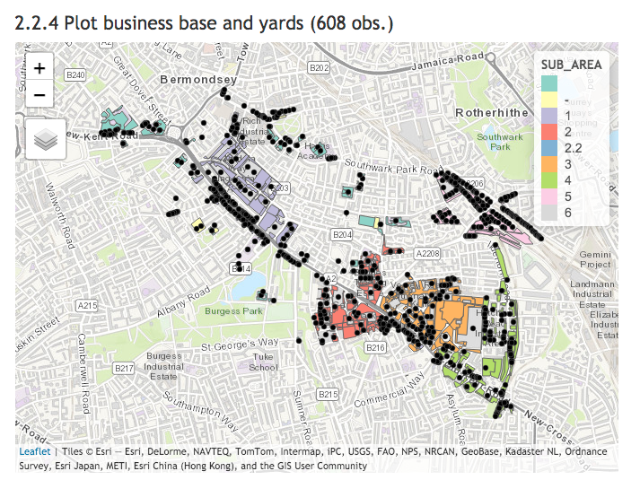                                                                                                                                                                                 |
+----+------------------------------------------------------------------------------------------------------------------------------------------------+------------------------------------------------------------------------------------------------------------------------------------------------------------------------------------------------------------------------------------------------------------------------------------+----------------------------------------------------------------------------------------------------------------------------------------------------------------------------------------------------------------+
| 9  | [Interactive map with survey results](https://npalomin.github.io/sind/sum_one.html)                                                            | Relevant variables (unedited, only buildings). Includes link to survey picture                                                                                                                                                                                                     | 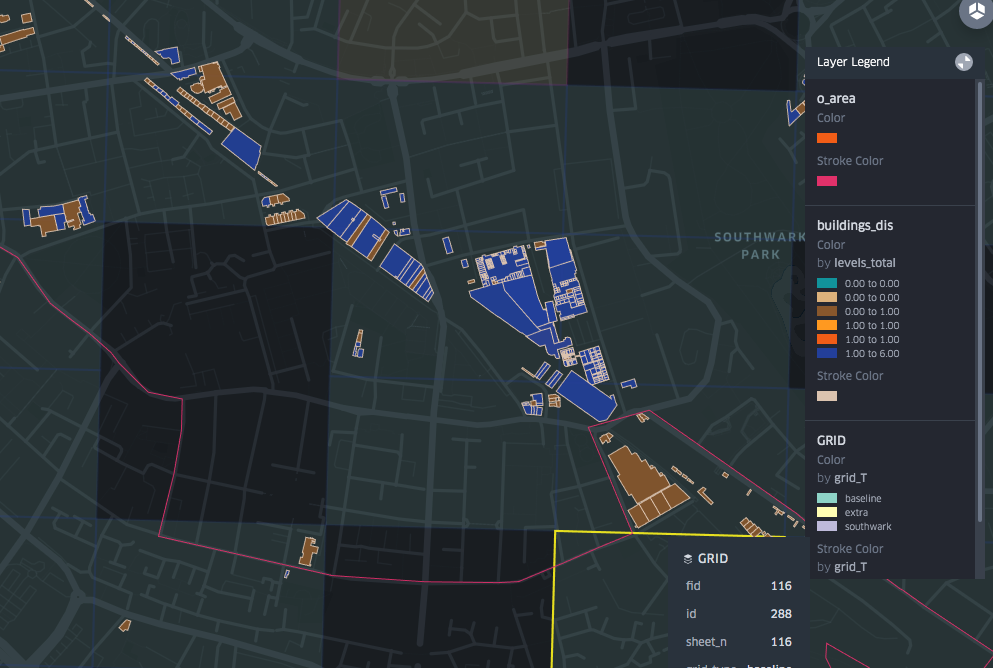                                                                                                                                                                                 |
+----+------------------------------------------------------------------------------------------------------------------------------------------------+------------------------------------------------------------------------------------------------------------------------------------------------------------------------------------------------------------------------------------------------------------------------------------+----------------------------------------------------------------------------------------------------------------------------------------------------------------------------------------------------------------+
| 8  | [Interactive map with preliminary survey results](https://npalomin.github.io/sind/oct2020.html)                                                | Survey as October 2020.                                                                                                                                                                                                                                                            | 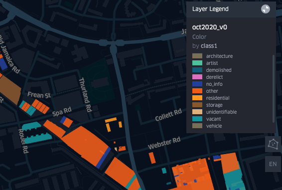                                                                                                                                                                                 |
|    |                                                                                                                                                |                                                                                                                                                                                                                                                                                    |                                                                                                                                                                                                                |
|    |                                                                                                                                                | Classification of industrial types from survey's business name and description (only buildings)                                                                                                                                                                                    |                                                                                                                                                                                                                |
+----+------------------------------------------------------------------------------------------------------------------------------------------------+------------------------------------------------------------------------------------------------------------------------------------------------------------------------------------------------------------------------------------------------------------------------------------+----------------------------------------------------------------------------------------------------------------------------------------------------------------------------------------------------------------+
| 7  | [Survey results data diagnosis](https://npalomin.github.io/sind/Exploratory-Data-Analysis.html)                                                | Data exploration of results downloaded from EpiCollect (form.csv)                                                                                                                                                                                                                  | 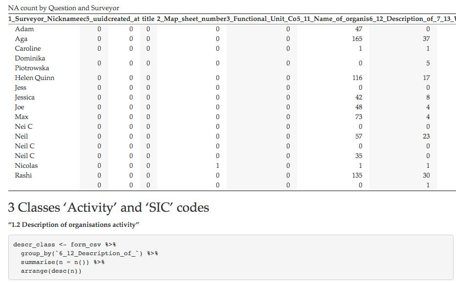                                                                                                                                                                                 |
|    |                                                                                                                                                |                                                                                                                                                                                                                                                                                    |                                                                                                                                                                                                                |
|    |                                                                                                                                                | [Summary of sheets by surveyor](https://npalomin.github.io/sind/survey_summary.html)                                                                                                                                                                                               |                                                                                                                                                                                                                |
+----+------------------------------------------------------------------------------------------------------------------------------------------------+------------------------------------------------------------------------------------------------------------------------------------------------------------------------------------------------------------------------------------------------------------------------------------+----------------------------------------------------------------------------------------------------------------------------------------------------------------------------------------------------------------+
| 6  | [Interactive map with data from Southwark](https://npalomin.github.io/sind/final_southwarkdata.html)                                           | 2019                                                                                                                                                                                                                                                                               | 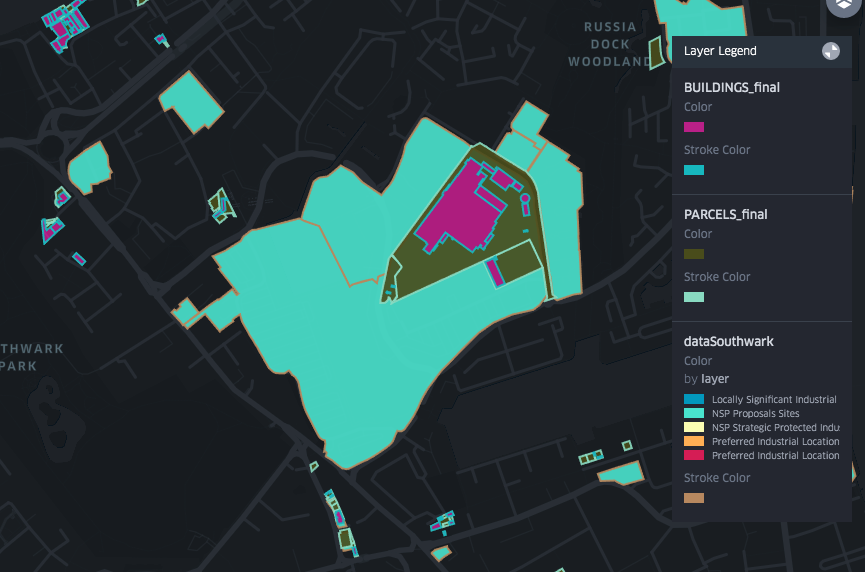                                                                                                                                                                                 |
|    |                                                                                                                                                |                                                                                                                                                                                                                                                                                    |                                                                                                                                                                                                                |
|    |                                                                                                                                                | Survey final base (BUILDINGS and PARCELS layer)                                                                                                                                                                                                                                    |                                                                                                                                                                                                                |
+----+------------------------------------------------------------------------------------------------------------------------------------------------+------------------------------------------------------------------------------------------------------------------------------------------------------------------------------------------------------------------------------------------------------------------------------------+----------------------------------------------------------------------------------------------------------------------------------------------------------------------------------------------------------------+
| 5  | [Interactive map with analysis of industrial/commercial land use](https://npalomin.github.io/sind/sal.html)                                    | Includes companies house data, GLA baseline, town centres (London Plan - indicative).                                                                                                                                                                                              | 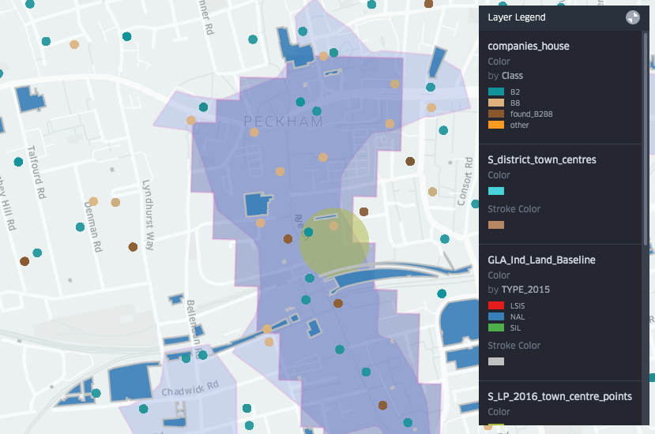                                                                                                                                                                                 |
|    |                                                                                                                                                |                                                                                                                                                                                                                                                                                    |                                                                                                                                                                                                                |
|    |                                                                                                                                                | [Disaggregated layers](https://docs.google.com/presentation/d/14-j5rHuWuZWiHPHQZ-ugH3pdClwpxdMFFUdfvMfjxu4/edit#slide=id.p)                                                                                                                                                        |                                                                                                                                                                                                                |
+----+------------------------------------------------------------------------------------------------------------------------------------------------+------------------------------------------------------------------------------------------------------------------------------------------------------------------------------------------------------------------------------------------------------------------------------------+----------------------------------------------------------------------------------------------------------------------------------------------------------------------------------------------------------------+
| 4  | [Industrial land data quality analysis](https://docs.google.com/presentation/d/1DnjWaGwhXkcFtgKHli-MIJciEcRRGw-tJAOWjBPmhWg/edit#slide=id.p)   | Examination of GLA industrial land data (2015 industrial land).                                                                                                                                                                                                                    | 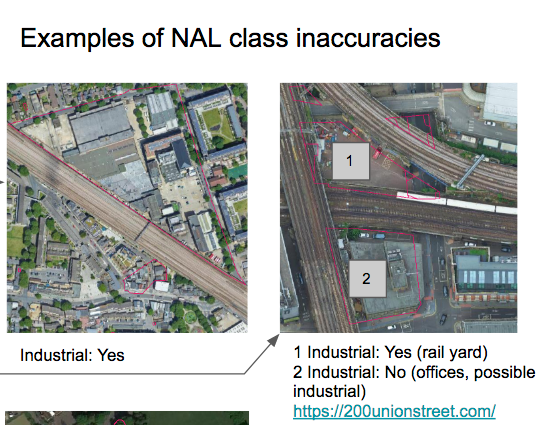                                                                                                                                                                                 |
|    |                                                                                                                                                |                                                                                                                                                                                                                                                                                    |                                                                                                                                                                                                                |
|    |                                                                                                                                                | Review of NAL type. Power substations with land use codes 9 (20) and 8 (21).                                                                                                                                                                                                       |                                                                                                                                                                                                                |
+----+------------------------------------------------------------------------------------------------------------------------------------------------+------------------------------------------------------------------------------------------------------------------------------------------------------------------------------------------------------------------------------------------------------------------------------------+----------------------------------------------------------------------------------------------------------------------------------------------------------------------------------------------------------------+
| 3  | [Review of SIC codes to define Industrial activity](https://npalomin.github.io/sind/SIC_industrial/SIC_industrial.html)                        | London Industrial Land Demand ([CAG Consultants, 2017](https://www.london.gov.uk/sites/default/files/ilds_revised_final_report_october_2017.pdf)) identified 377 business codes (out of 731). Some industrial activities excluded (e.g. washing, maintenance, storage activities). | 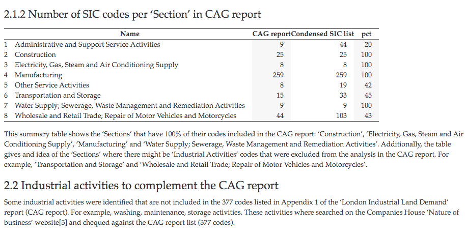                                                                                                                                                                                 |
+----+------------------------------------------------------------------------------------------------------------------------------------------------+------------------------------------------------------------------------------------------------------------------------------------------------------------------------------------------------------------------------------------------------------------------------------------+----------------------------------------------------------------------------------------------------------------------------------------------------------------------------------------------------------------+
| 2  | [Spatial data pre-processing for survey preparation](https://github.com/npalomin/sind/blob/master/filter_method.md#spatial-data-preprocessing) | Pattern recognition for identification of industrial units (buildings and parcels)                                                                                                                                                                                                 | 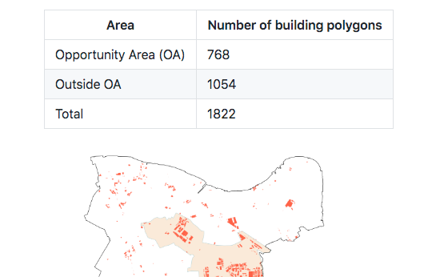                                                                                                                                                                                 |
|    |                                                                                                                                                |                                                                                                                                                                                                                                                                                    |                                                                                                                                                                                                                |
|    |                                                                                                                                                | Base on GLA Baseline, Mastermap and Land Registry Data                                                                                                                                                                                                                             |                                                                                                                                                                                                                |
|    |                                                                                                                                                |                                                                                                                                                                                                                                                                                    |                                                                                                                                                                                                                |
|    |                                                                                                                                                | Interactive map of [Filter lax](https://npalomin.github.io/sind/filter_1.html) and [Filter restrictive](https://npalomin.github.io/sind/filter_2.html)                                                                                                                             |                                                                                                                                                                                                                |
|    |                                                                                                                                                |                                                                                                                                                                                                                                                                                    |                                                                                                                                                                                                                |
|    |                                                                                                                                                | [Summary of selected buildings by land use](https://npalomin.github.io/sind/landuse_type.html)                                                                                                                                                                                     |                                                                                                                                                                                                                |
+----+------------------------------------------------------------------------------------------------------------------------------------------------+------------------------------------------------------------------------------------------------------------------------------------------------------------------------------------------------------------------------------------------------------------------------------------+----------------------------------------------------------------------------------------------------------------------------------------------------------------------------------------------------------------+
| 1  | [Spatial Survey Methodology](https://github.com/npalomin/sind/blob/master/training.md#southwark-industrial-auditsia-field-survey-training)     | Set of instructions for conducting spatial survey of industrial units                                                                                                                                                                                                              |                                                                                                                                                                                  |
+----+------------------------------------------------------------------------------------------------------------------------------------------------+------------------------------------------------------------------------------------------------------------------------------------------------------------------------------------------------------------------------------------------------------------------------------------+----------------------------------------------------------------------------------------------------------------------------------------------------------------------------------------------------------------+
